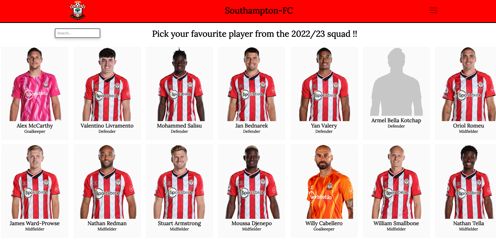

# full-stack-project

Full-stack web application !!

The week 12 challenge, on the nology course, was to build a full-stack web application. 
The task aimed to solidify the key concepts we've learned so far, including Java, Spring, MySQL and React.

Requirements 

1- React Frontend

2- Java/SpringBoot Backend with the following dependencies:
  - Maven Project 
  - Java v11 
  - Jar 
  - Spring Web 
  - My SQL Driver 
  - Spring Data JPA
  
 3- Should be able to CRUD from a local database
 

Completed project below !!

